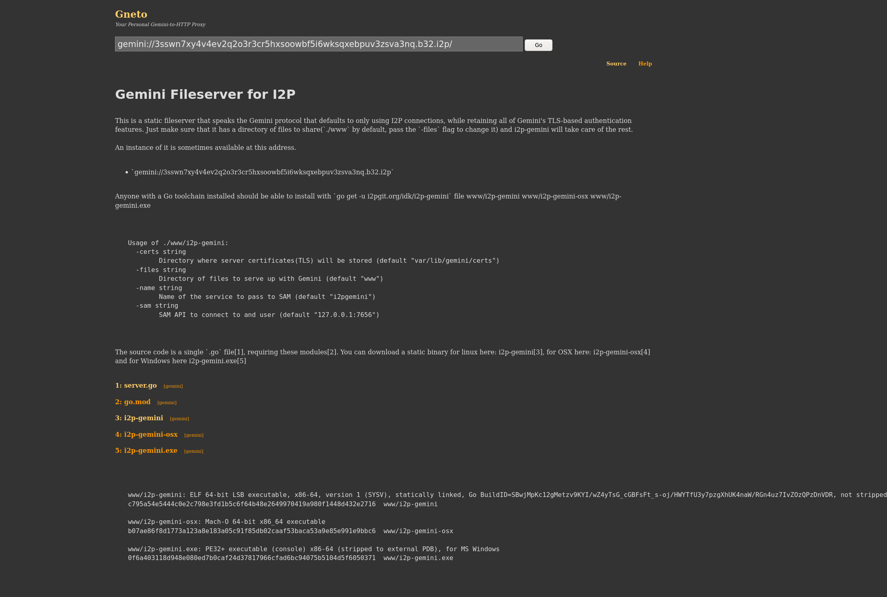

Gemini Fileserver for I2P
=========================

This is a static fileserver that speaks the Gemini protocol
that defaults to only using I2P connections, while retaining
all of Gemini's TLS-based authentication features. Just make
sure that it has a directory of files to share(`./www` by
default, pass the `-files` flag to change it) and i2p-gemini
will take care of the rest.

An instance of it is sometimes available at this address.

 - `gemini://3sswn7xy4v4ev2q2o3r3cr5hxsoowbf5i6wksqxebpuv3zsva3nq.b32.i2p`

Anyone with a Go toolchain installed should be able to install
with `go get -u i2pgit.org/idk/i2p-gemini`
file www/i2p-gemini www/i2p-gemini-osx www/i2p-gemini.exe

Here's a screenshot of it running in gneto.



```
Usage of ./www/i2p-gemini:
  -certs string
    	Directory where server certificates(TLS) will be stored (default "var/lib/gemini/certs")
  -files string
    	Directory of files to serve up with Gemini (default "www")
  -name string
    	Name of the service to pass to SAM (default "i2pgemini")
  -sam string
    	SAM API to connect to and user (default "127.0.0.1:7656")
```

[The source code is a single `.go` file](server.go), requiring these
[modules](go.mod). You can download a static binary for linux here:
[i2p-gemini](www/i2p-gemini), for OSX here: [i2p-gemini-osx](www/i2p-gemini-osx)
and for Windows here [i2p-gemini.exe](www/i2p-gemini.exe)

```
www/i2p-gemini: ELF 64-bit LSB executable, x86-64, version 1 (SYSV), statically linked, Go BuildID=SBwjMpKc12gMetzv9KYI/wZ4yTsG_cGBFsFt_s-oj/HWYTfU3y7pzgXhUK4naW/RGn4uz7IvZOzQPzDnVDR, not stripped
c795a54e5444c0e2c798e3fd1b5c6f64b48e2649970419a980f1448d432e2716  www/i2p-gemini

www/i2p-gemini-osx: Mach-O 64-bit x86_64 executable
b07ae86f8d1773a123a8e183a05c91f85db02caaf53baca53a9e85e991e9bbc6  www/i2p-gemini-osx

www/i2p-gemini.exe: PE32+ executable (console) x86-64 (stripped to external PDB), for MS Windows
0f6a403118d948e080ed7b0caf24d37817966cfad6bc94075b5104d5f6050371  www/i2p-gemini.exe
```

